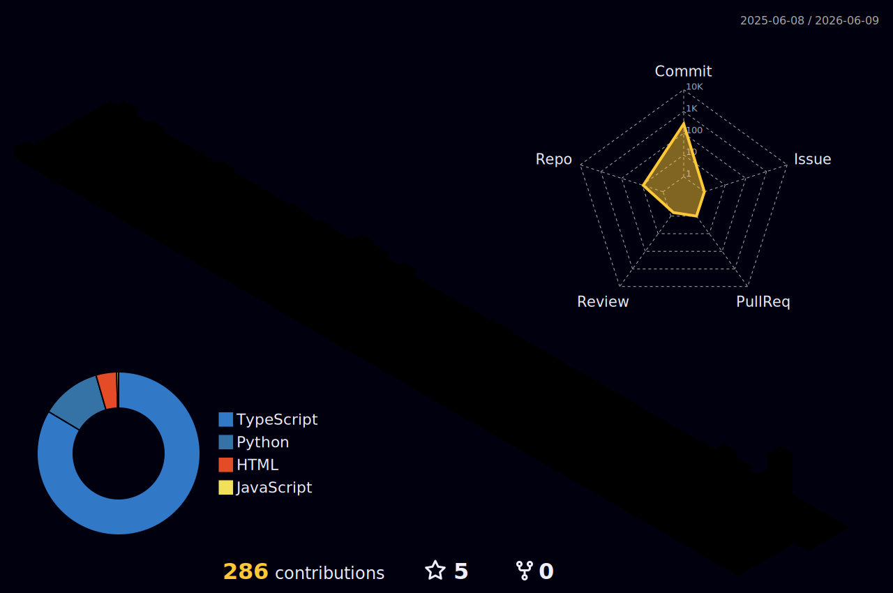

<!-- DYNAMIC HEADER SVG (auto-updated every hour with greeting) -->

  

<!-- TYPING SVG -->

  

 

  
  &nbsp;
  
  &nbsp;

---

<!-- SNAKE ANIMATIONS (auto-updated every 6 hours) -->

<picture>
  <source media="(prefers-color-scheme: dark)"  srcset="./dist/snake-dark.svg"/>
  <source media="(prefers-color-scheme: light)" srcset="./dist/snake-dark.svg"/>
  
</picture>

 

---

## Who am i?

**Name**     : Abdallh Elzorkany  
**Role**     : Software Engineer | Front-end Engineer  
**Location** : Egypt 🇪🇬  
**Status**   : Open to Work  
**Focus**    : Next.js · React · TypeScript · Clean Architecture

---

## Stats

<!-- GITHUB METRICS (auto-updated every 3 hours) -->

 

 

 

---

## Tech Stack

**⚙️ Frond-End & Languages**

  

**☁️ Cloud & Infrastructure**

  

**🔧 Tools & Platforms**

  

---

---

## Projects

---

## Problem Solving

  

---

## Trophies

  

---

## 3D Contribution Calendar

  

## Connect With Me

  

  

  

*"I'm not a great programmer; I'm just a good programmer with great habits."*
**— Kent Beck**

<!-- FOOTER -->

